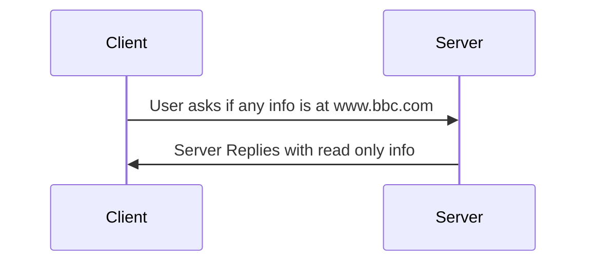
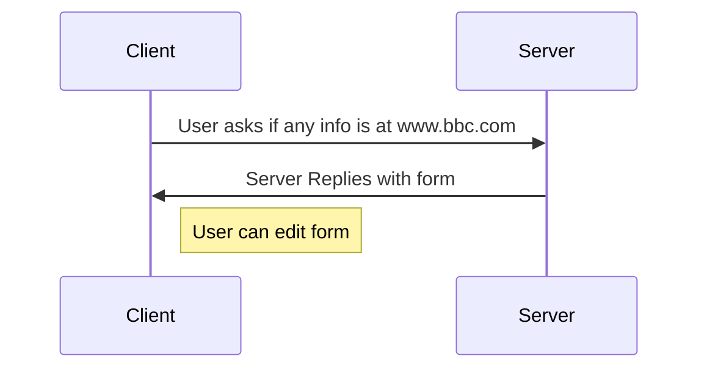
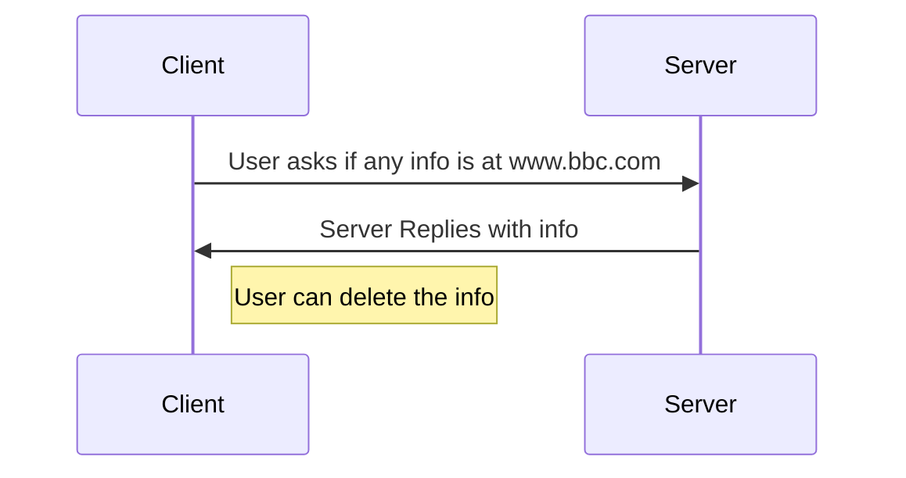
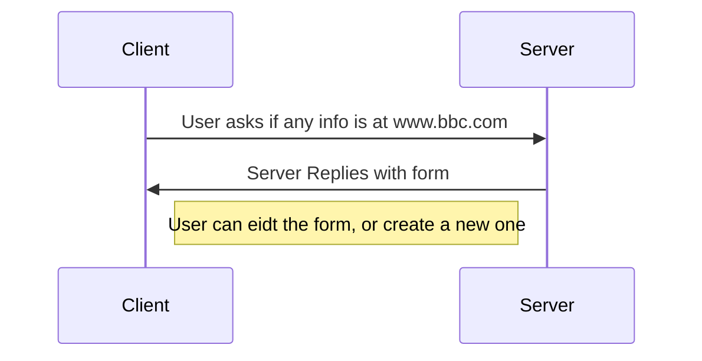

# RESTful
## Representationa state transfer 

when computers first started to talk to each other, the client twould directly send commands to the computer to change infomation in a database, form, web page etc. 

This could lead to security issues, and it ment that the server could easly see what the client was up to 

One of the ways that this was solved was by the client being given data by the server, and then updating that data and sending the data back to the server when it was complete.

Today this is usually accomplished via sending either xml or json based resources to the user, which they can then edit (if the have the correct HTTP method) and then send back to the server.

The analogy used is that the server is a book, where clients can write and edit certian pages of the book

## Resources 
REST utilises resources, entities that can be passed between the client and the server. The two main standards for passing resources are XML and JSON 

### XML
```xml
    <car>
    <company>Toyota</company>
    <model>Yaris</model>
    <doors>5</doors>
    <automatic type="xs:hexBinary">true</automatic>
    </car>
```
### JSON
```json
    car
    {
        "company":"Toyota",
        "model":"Yaris",
        "doors":"5",
        "automatic":true,
    }
```

## Statelessness
Due to the fact that when the client has access to the resource, the server cant see what is happneing, and only has the old resource infomation, the infomation on the client side is unkonown to the server. 

> A good example of this is when the client refreshes a page that has a form on - beacause the client has not sent back any data to the server, the server still uses the old data, so the resource has either old data, or has not been created yet.


## HTTP methods
All HTTP methods should be understood as if the client is asking the server about a certian url, the server then respons with a page (that can contain multiple HTTP Methods)

### GET 
This provides read only access to the client, the client gets the resourse, but cannot edit the content of the resources 

> In the book analogy, this is as if the owner gives a page of the book to the user, but they cannot edit the page.



### POST 
This allows for the client to get and edit the data (usually in a form) and will result in the creation of a new resource (duplicates are checked in a database, the HTTP doesnt care). 

> In the book analogy, this is as if the client is given a new page to write on, the page might have pre-existing work on, but the page will be put back into the book as a new page.



### DELETE
This is used the remove a resource, 

> In the book analogy, this is as if the client is allowd to pick a page and remove work from it. 



### PUT
This allows for a client to update an existing resource, or create a new one if it does not exist already, in the same manner as a POST method

> In the book analogy, this is as if the client is allowed to add a new page of infomation, or if there is already a page with the same infomation on it, then they are allowed to edit the infomation on the page.


